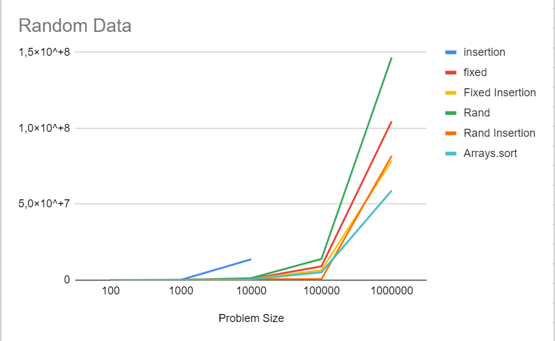
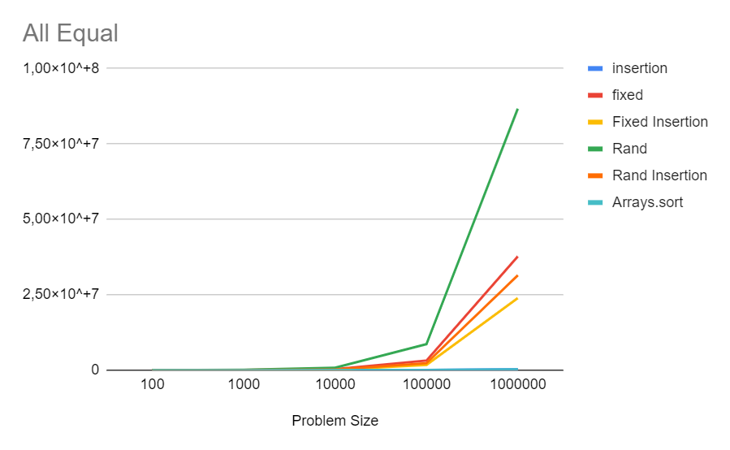
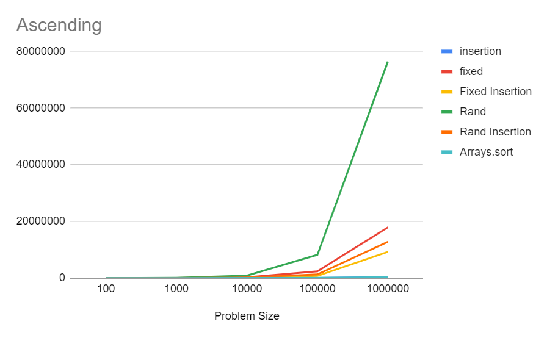
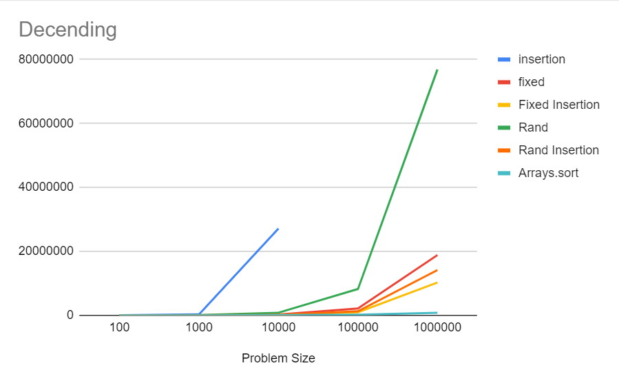

# A Study of Quicksort

Marcus Bardvall
INDA Group 21
2022

## Characteristics and Complexity

	In this section, briefly discuss:
	* Origins of Quicksort

Quicksort is one of the faster and most used sorting algorithms. It was developed by the British computer scientist Tony Hoard in 1989. He got into sorting algorithms while working on a machine translation project in Moscow where he needed to sort words in Russian sentences before looking them up in a dictionary. He realized that insertion sort would be slow and came up with the partitioning part of many sorting algorithms today. Later he came up with the Quicksort we know today.

	* Its characteristics

Quicksort is characterized as a divide-and-conquer algorithm. Where the algorithm “splits” up the list to partitions by selecting a pivot element. The pivot can, in theory, be anywhere in the list. After that the sub-arrays that are left are sorted recursively, meaning the method calls upon itself till the list is finished sorted.

It is also classed as a comparison sort, which means that the sorting is done by comparing elements to each other.

	* Its runtime complexity

The worst-case occurs when the process of partitioning always picks the greatest or the smallest element as a pivot. The worst case would occur if we, for example, would always pick the last element as pivot, and the array is already sorted in descending or ascending order. Resulting in O(n^2). This is why it is especially important to pick a good pivot element as poor choices of pivot can drastically affect the performance of the algorithm.
Good choices of pivots yield O(nlogn) performance on average and the absolute best case for quicksort occurs if the middle element is picked as pivot, which also results in O(nlogn).

	

## Variations of Quicksort

	In this section:
	* Outline each variation you implemented
	* Include snippets of code where relevant (e.g. different partition routines)
	* Discuss your cut-off strategy

QuickSortFixedPivot:
This implementation of quicksort uses the “normal” quicksorting method. What is unique with this implementation is the choice of pivot and method of partition. For this task I have implemented the hoarePartition which chooses the first element of the array as pivot:

public int partition(int[] array, int low, int high) {
       pivot = array[low];
       i = low - 1;
       j = high + 1;
 
       while (true)
       {
           do {
               i++;
           } while (array[i] < pivot);
 
           do {
               j--;
           } while (array[j] > pivot);
 
           if (i >= j) {
               return j;
           }
 
           swap(array, i, j);
       }
   }

QuicksortFixedPivotInsertion:
Same as above, however if (high-low) <=50 it calls upon insertion sort to do the rest. Why we do this is because insertion sort is faster when sorting smaller lists. So we make a cutoff point to call upon insertion sort when the list has reached the cutoff point. General strategy is to take a big list and sort it with quicksort first and when it has reached a certain point, insertion sort will sort the rest. (Motivation for cutoffpoint=50 in a later section)

if(array.length>1)
       {
           qsort(array, 0, array.length-1);
           insertion.sort(array);
       }

QuicksortRandomPivot:
Very similar in code to the Fixedpivot implementation with just one key difference. Before the partition begins we generate a random integer and swap it with the first element in the list. And then when we call upon the hoare-partition method, it will use the random pivot as pivot instead of the first element because we swapped them.

public int rpartition(int[] array, int first, int last) {
       Random rand = new Random();
       int pivot = rand.nextInt(last-first) + first;
       swap(array, pivot, first);
       return partition(array, first, last);
   }

QuicksortRandomPivotInsertion:
Similar to the fixed pivot insertion, just with the random pivot implementation added to it. We begin to generate a random pivot, then partition and then when the cutoff point has been reached, the insertion sort begins until the list is completely sorted.

Motivation for the cutoffpoint
Did some very basic testing with small lists in the main method and stuck with 50 since lower numbers seemed to be slower. This may not be an optimal choice for a cutoff point and would require more testing to find a more efficient cutoff point than 50.

## Methodology

	In this section, describe the tests you performed, making reference to:
	* Test data
	* Problem size
	* Algorithms used

For the time testing, I created a new class called TimingMeasure where I coded some tools to make it easier to test all variations of quicksort and also the test data included. The data that was tested was; Random, All equal, Ascending, and Descending with the problem sizes of 100, 1000, 10 000, 100 000, and 1 000 000. However, I did not just print one test. The methods created in the TimingMeasure have an option where you can set the number of repetitions (how many times you want to test), once that is done it will calculate an average and print it as well as the maximum value and the minimum value. In my results, I used 100 repetitions for each test because it seemed like enough. The data class was used to ensure that properly generated new arrays would be sorted. The stopwatch class was used to measure the time, the time was measured in nanoseconds (ns).

## Results

	In this section:
	* Present a table for the data from each test
	* Generate charts (use Matlab or another tool) to show the data
	* Ensure you label each clearly

Random Data:
| Problem Size | insertion | fixed     | Fixed Insertion | Rand      | Rand Insertion | Arrays.sort |
|--------------|-----------|-----------|-----------------|-----------|----------------|-------------|
|          100 |     26467 |      6100 |           21364 |      9831 |          22482 |        1253 |
|         1000 |    170928 |     58183 |           70198 |    125110 |          61754 |       20192 |
|        10000 |  13712115 |    796069 |          553401 |   1258711 |         533464 |      452369 |
|       100000 | too long  |   9027735 |         6456465 |  13917165 |         683271 |     5109514 |
|      1000000 | too long  | 104570949 |        78577967 | 146651688 |       81849886 |    58926276 |

All Equal:
| Problem Size | insertion | fixed    | Fixed Insertion | Rand     | Rand Insertion | Arrays.sort |
|--------------|-----------|----------|-----------------|----------|----------------|-------------|
|          100 |      2027 |     4448 |            2947 |     6567 |           2771 |        1279 |
|         1000 |     12030 |    21714 |           20305 |    83082 |          20631 |        5895 |
|        10000 |     32575 |   302552 |          113173 |   779653 |         201223 |       37160 |
|       100000 |     51314 |  3167453 |         1755868 |  8581302 |        2298054 |       44307 |
|      1000000 |    331527 | 37703316 |        23864578 | 86677771 |       31473116 |      248448 |

Ascending:
| Problem Size | insertion | fixed    | Fixed Insertion | Rand     | Rand Insertion | Arrays.sort |
|--------------|-----------|----------|-----------------|----------|----------------|-------------|
|          100 |      1978 |     4027 |            3116 |     8259 |           4302 |         793 |
|         1000 |      6164 |    29496 |           10223 |    97766 |          14964 |        3265 |
|        10000 |     29909 |   273495 |           76491 |   841435 |         154192 |       60115 |
|       100000 |     49175 |  2330694 |          721512 |  8185636 |        1250865 |       72693 |
|      1000000 |    362998 | 17845994 |         9221505 | 76411315 |       12762131 |      303312 |

Descending:
| Problem Size | insertion | fixed    | Fixed Insertion | Rand     | Rand Insertion | Arrays.sort |
|--------------|-----------|----------|-----------------|----------|----------------|-------------|
|          100 |     35071 |     4763 |            3235 |     8173 |           4467 |        1466 |
|         1000 |    310913 |    44498 |           15196 |   102309 |          24509 |        8207 |
|        10000 |  27141494 |   265126 |          118779 |   817968 |         147527 |       84092 |
|       100000 |  too long |  2147006 |          968280 |  8237052 |        1265152 |      195712 |
|      1000000 |  too long | 18825418 |        10250230 | 76858864 |       14153387 |      775604 |

## Discussion

	In this section:
	* Discuss your general findings based on the data
	* What was surprising
	* What met your expectations
	* Which variation was closet to Arrays.sort?

I did not expect randomPivot to be so slow, thought that a random pivot would hit a good pivot element many times but I was proven wrong. Fixed pivot insertion was also a bit slower than I expected, I thought this was going to be a close match with arrays.sort since the middle element is a good pivot, however I think this is because the Arrays.sort algorithm uses a more advanced algorithm, possibly based on the 3 way partition which is supposed to be better.

The things that met my expectations were that insertion sort was fast on the ascending data and that it was generally slow on larger lists. Also, no surprise here, arrays.sort was incredibly fast compared to the others.

When it comes to the question about which variation was closest to Array.sort, my testing would give fixed pivot insertion as the general winner. However insertion was close to arrays.sort when it came to ascending arrays, and sometimes beating it.
